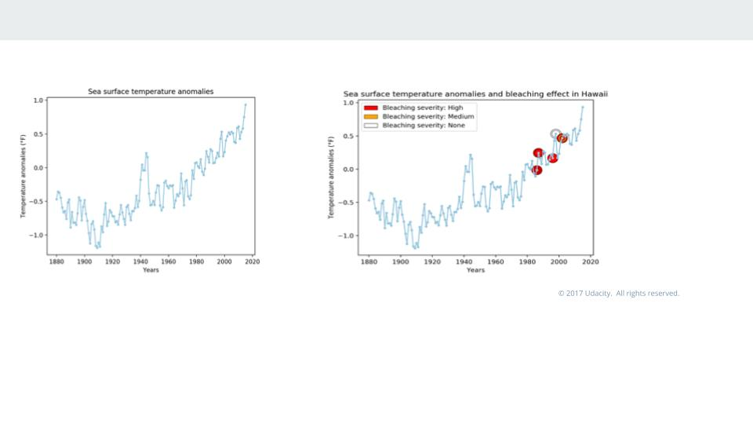

# Project Climate change and Biodiversity

The information below was the part that I did for the collaborative project called: "Climate change and biodiversity" during the Challenge course from Udacity in data analytics. 

Our research question was focus on understand which factors are affecting the coral bleaching and which influence had this process in the biodiversity.

Our hypothesis was in based on published data the increase greenhouse gas emissiond have caused warmer and acidics oceans producing in coral bleaching due the thermal and the acidications in coral reefs. 

### Overview:

## Some important information and resources:

1.- National Ocean Service, What is coral bleaching? https://oceanservice.noaa.gov/facts/coral_bleach.html 

2.- Climate Change Indicators: Sea Surface Temperature: https://www.epa.gov/climate-indicators/climate-change-indicators-sea-surface-temperature

3.- Climate Change Indicators: Ocean Acidity; https://www.epa.gov/climate-indicators/climate-change-indicators-ocean-acidity 

4.- http://www.reefbase.org/gis_maps/datasets.aspx

5.- https://www.pifsc.noaa.gov/cred/ocean_acidification.php

6.- https://www.iucn.org/resources/issues-briefs/ocean-warming

